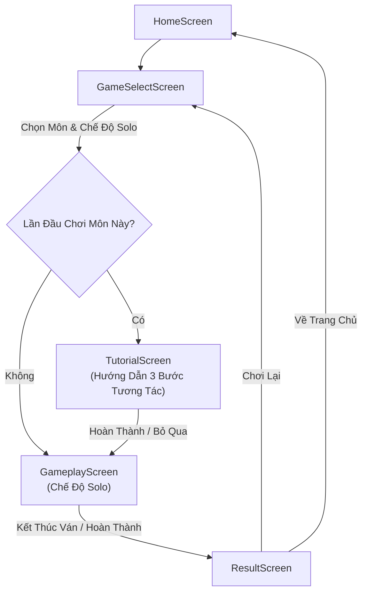
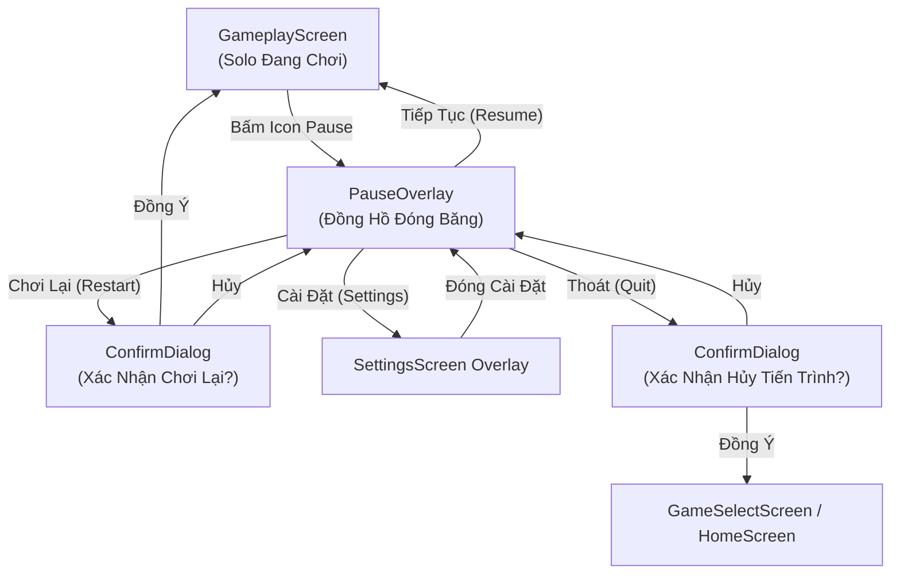
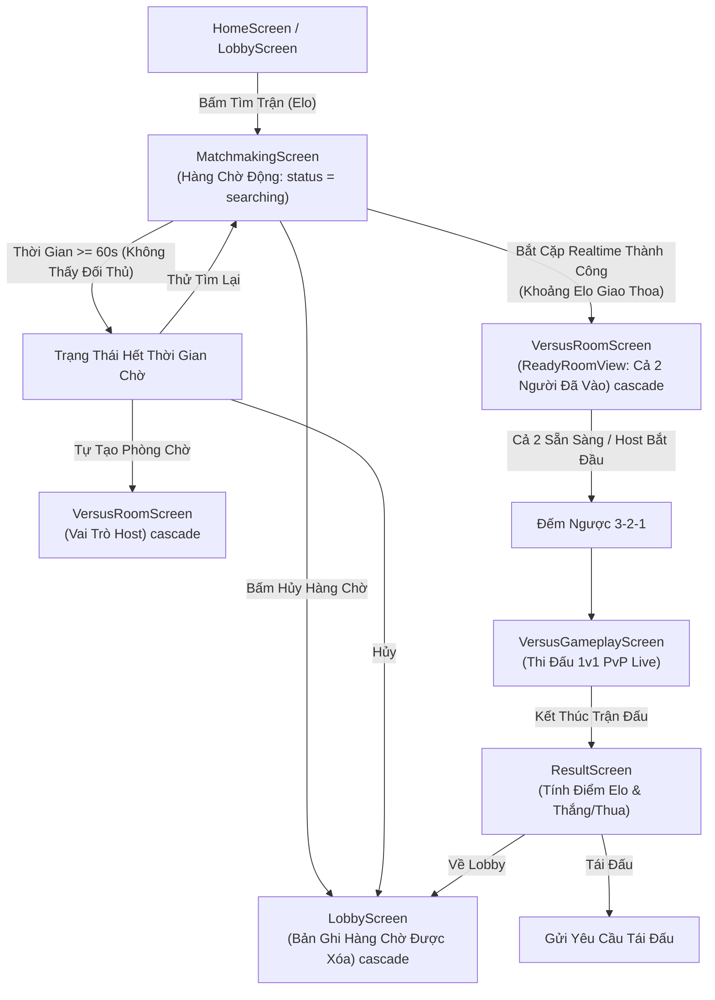
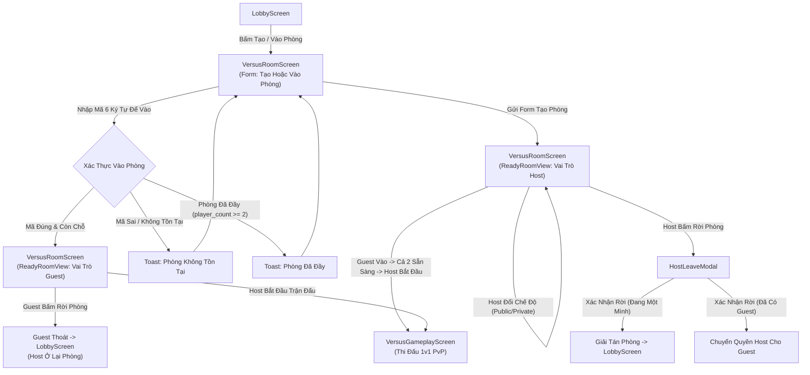
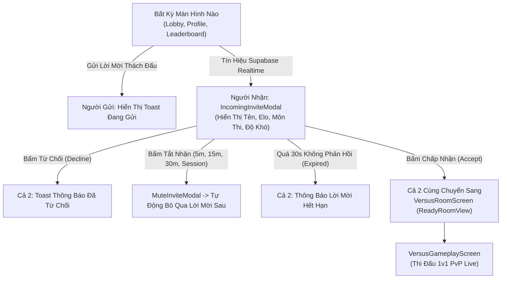
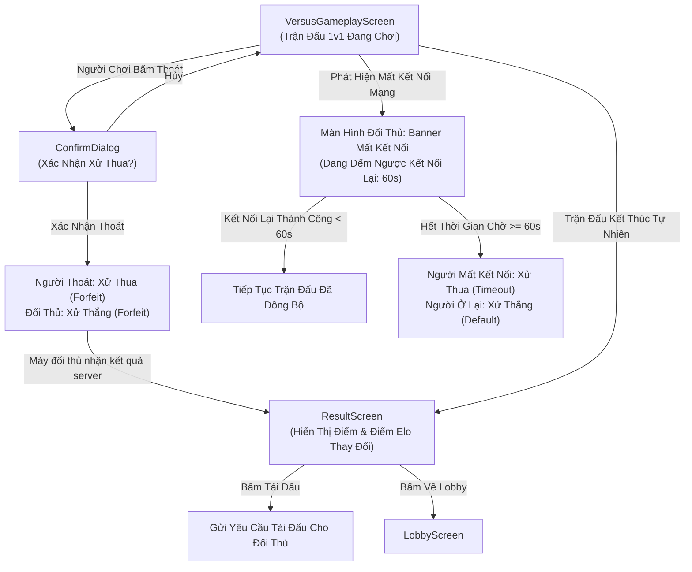

# Memory Arena — Danh Sách Màn Hình & Luồng Người Dùng Chuẩn (Master Screen Inventory & User Flows)

Tài liệu này là nguồn chuẩn duy nhất (Single Source of Truth) phục vụ việc phát triển Product, UI/UX, Frontend và Backend cho tất cả các luồng người dùng, màn hình, overlay và các trường hợp biên (edge cases) trong ứng dụng **Memory Arena (GameBoard)**.

---

## 1. Danh Sách Màn Hình & Overlay Chuẩn Hóa

### 1.1 Màn Hình Điều Hướng Chính
- **`LandingScreen`**: Màn hình mở ứng dụng lần đầu hoặc dành cho người dùng chưa đăng nhập (cung cấp tùy chọn Chơi Guest hoặc Đăng nhập).
- **`LoginScreen`**: Màn hình xác thực tài khoản (hỗ trợ Email/Password, Google OAuth và Discord OAuth).
- **`HomeScreen`**: Dashboard mặc định sau khi đăng nhập, tập trung vào chế độ chơi đơn cá nhân và tiến trình hàng ngày.
- **`LobbyScreen`**: Trung tâm tính năng xã hội, duyệt danh sách phòng công khai, danh sách bạn bè và nhận lời mời thách đấu.
- **`ProfileScreen`**: Màn hình thông tin cá nhân hiển thị điểm ELO, lịch sử đấu, thống kê tổng thể và thành tựu.
- **`SettingsScreen`**: Màn hình cấu hình ứng dụng (Âm thanh hiệu ứng, Phản hồi rung haptics, Giao diện Theme, Ngôn ngữ).
- **`LeaderboardScreen`**: Bảng xếp hạng cạnh tranh giữa các người chơi toàn cầu và theo từng thể loại game.

### 1.2 Màn Hình Game & Hàng Chờ Matchmaking
- **`GameSelectScreen`**: Màn hình chọn thể loại trò chơi (Số, Chữ cái, Ma trận, Chuỗi, Màu sắc) và chế độ chơi.
- **`TutorialScreen`**: Màn hình/Overlay hướng dẫn tương tác 3 bước xuất hiện trước khi chơi lần đầu cho mỗi thể loại game.
- **`GameplayScreen`**: Màn hình chơi game đơn (Solo Practice và Solo Ranked).
- **`MatchmakingScreen`**: Màn hình hàng chờ tìm trận Xếp hạng 1v1 ELO thời gian thực với hiệu ứng radar và khoảng ELO mở rộng.
- **`VersusRoomScreen`**: Màn hình phòng chờ 1v1 quản lý việc tạo phòng, vào phòng và trạng thái sẵn sàng thi đấu (`ReadyRoomView`).
- **`VersusGameplayScreen`**: Màn hình thi đấu 1v1 PvP thời gian thực đồng bộ bảng đấu và theo dõi tiến trình đối thủ.
- **`ResultScreen`**: Màn hình tổng kết ván đấu (Hiển thị điểm số, cấp độ hoàn thành, thay đổi ELO và tùy chọn tái đấu/về trang chủ).

### 1.3 Overlays & Modals
- **`PauseOverlay`**: Modal tạm dừng trận đấu (Chỉ áp dụng cho chế độ chơi đơn Solo).
- **`IncomingInviteModal`**: Pop-up lời mời thách đấu nổi trên bất kỳ màn hình nào qua kết nối Supabase Realtime.
- **`HostLeaveModal`**: Pop-up xác nhận rời phòng của Chủ phòng (xử lý chuyển quyền Chủ phòng hoặc giải tán phòng).
- **`MuteInviteModal`**: Modal cấu hình tạm tắt nhận lời mời thách đấu (5 phút, 15 phút, 30 phút, hoặc trong phiên).
- **`FriendProfileModal`**: Overlay xem thông tin hồ sơ công khai của bạn bè hoặc người chơi khác.
- **`ConfirmDialog`**: Pop-up xác nhận hành động nguy hiểm (Rời trận đấu, Đăng xuất).
- **`Toast`**: Thông báo dạng thanh nổi trên cùng (`z-[100]`) hiển thị phản hồi hệ thống và thông báo lỗi.

---

## 2. Luồng Người Dùng Chơi Đơn (Solo User Flows)

### 2.1 Luồng Vào Trận Solo Practice & Solo Ranked

Luồng chơi đơn hoạt động độc lập với trạng thái mạng xã hội và có kích hoạt hướng dẫn Tutorial khi chơi lần đầu.

#### Chi Tiết Các Bước & Trường Hợp Biên:
1. **Khởi đầu**: Người dùng chuyển từ `HomeScreen` sang `GameSelectScreen`.
2. **Chọn môn & chế độ**: Chọn 1 trong 5 thể loại (Số, Chữ cái, Ma trận, Chuỗi, Màu sắc) và chọn **Solo Practice** (Luyện tập) hoặc **Solo Ranked** (Xếp hạng đơn).
3. **Kiểm tra Tutorial**:
   - Nếu là lần đầu chơi thể loại này: Chuyển hướng sang `TutorialScreen`.
   - Người dùng có thể hoàn thành 3 bước hoặc bấm **Bỏ qua** (`Skip Tutorial Flow`).
4. **Thực thi Gameplay**: Vào màn hình `GameplayScreen`.
5. **Kết thúc ván**: Sau khi hết lượt hoặc hoàn thành màn chơi, chuyển sang `ResultScreen`.
   - **Kết quả Solo Practice**: Hiển thị tổng điểm, cấp độ cao nhất đạt được và chỉ số tốc độ.
   - **Kết quả Solo Ranked**: Hiển thị tổng điểm, cấp độ đạt được và score breakdown; không đổi Elo.
   - **Kết quả Versus Ranked**: Hiển thị thắng/thua, tổng điểm và biến động Elo theo công thức chess-Elo/K-factor.
6. **Thoát / Chơi lại**:
   - Bấm **Chơi lại**: Quay về `GameSelectScreen`.
   - Bấm **Về trang chủ**: Quay về `HomeScreen`.

---

### 2.2 Luồng Tạm Dừng Khi Chơi Đơn (Solo Gameplay & Pause Overlay Flow)

#### Chi Tiết Các Bước & Trường Hợp Biên:
- **Tạm dừng**: Bấm nút Pause mở `PauseOverlay` và đóng băng ngay lập tức đồng hồ đếm ngược cùng ma trận đáp án.
- **Tiếp tục**: Đóng `PauseOverlay` và tiếp tục đếm ngược thời gian.
- **Mở Cài đặt**: Mở `SettingsScreen` dưới dạng overlay đè lên `PauseOverlay`. Thay đổi âm thanh/haptics có hiệu lực ngay lập tức. Đóng Cài đặt quay lại `PauseOverlay`.
- **Chơi lại từ đầu**: Mở `ConfirmDialog`. Nếu xác nhận, reset lại seed trận đấu và bắt đầu lại `GameplayScreen`.
- **Thoát ván**: Mở `ConfirmDialog`. Nếu xác nhận, hủy bỏ tiến trình trận đấu và quay về `GameSelectScreen` (hoặc `HomeScreen`).

---

## 3. Luồng Tìm Trận Nhanh 1v1 Elo (Quick Match Flow)

Quick Match ghép cặp 2 người chơi online đang cùng ở trong hàng chờ Matchmaking với khoảng điểm ELO giao thoa. Quick Match hoạt động theo mô hình bình đẳng (không có khái niệm Chủ phòng/Host).

#### Chi Tiết Các Bước, Trường Hợp Biên & Lỗi:
1. **Vào hàng chờ**: Người dùng vào `MatchmakingScreen`. Đăng ký bản ghi trong `matchmaking_queue` với `status = 'searching'` và khoảng ELO ban đầu `±100`.
2. **Tự mở rộng khoảng ELO**: Mỗi 10 giây nếu chưa thấy đối thủ, khoảng ELO tự động mở rộng thêm `±50` (tối đa `±300` ELO từ giây thứ 30+).
3. **Hủy hàng chờ (`Queue Cancel`)**:
   - Bấm **Hủy Hàng Chờ** hoặc bấm nút Back sẽ thực thi `leaveQueue()`.
   - Xóa bản ghi tìm trận trong DB và đưa người dùng quay về `LobbyScreen`.
4. **Hết thời gian chờ (`Queue Timeout`)**:
   - Nếu sau 60 giây không có ai trùng khoảng ELO vào hàng chờ, tiến trình đếm ngược dừng lại.
   - Người dùng được chọn 1 trong 3 hướng:
     - **Tự Tạo Phòng Chờ**: Chuyển sang `VersusRoomScreen` mở phòng công khai với vai trò Host.
     - **Thử Tìm Lại**: Reset đồng hồ đếm và quét hàng chờ lại từ đầu từ khoảng `±100 ELO`.
     - **Hủy**: Quay về `LobbyScreen`.
5. **Bắt cặp thành công (`Match Found`)**:
   - Khi Người A và Người B có khoảng ELO trùng khớp trong hàng chờ, Supabase Realtime cập nhật trạng thái cả 2 thành `matched` và gắn mã phòng `room_code`.
   - Cả 2 thiết bị tự động chuyển sang `VersusRoomScreen` ở giao diện `ReadyRoomView`.
6. **Sẵn sàng & Đếm ngược**:
   - `VersusRoomScreen` hiển thị avatar, tên và điểm ELO của cả 2 người chơi.
   - Khi cả 2 xác nhận sẵn sàng (hoặc Host bấm Bắt đầu), đếm ngược 3-2-1 kích hoạt.
   - Chuyển tiếp sang `VersusGameplayScreen`.

---

## 4. Luồng Phòng Thách Đấu Tùy Chỉnh (Custom Versus Room Flow)

Phòng tùy chỉnh cho phép người chơi làm Chủ phòng (Host) tạo phòng công khai/riêng tư, cấu hình bộ môn/độ khó, mời bạn bè hoặc nhập mã phòng 6 ký tự để vào đấu.

#### Chi Tiết Các Bước, Trường Hợp Biên & Lỗi:
1. **Tạo phòng**:
   - Host thiết lập Thể loại game, Chế độ (Versus Ranked / Versus Unranked), Độ khó (Easy, Medium, Hard, Super Hard), Tên phòng và Chế độ riêng tư (Public hoặc Private).
   - Sau khi tạo thành công, bản ghi được lưu vào `versus_rooms` và Host vào giao diện `ReadyRoomView`.
2. **Vào phòng**:
   - Người chơi nhập mã 6 ký tự hoặc bấm **Vào** trực tiếp từ **Danh sách phòng khả dụng** ở `LobbyScreen`.
   - **Phòng không tồn tại (`Room Not Found`)**: Nếu nhập mã sai hoặc phòng đã bị hủy, trả về lỗi `RoomNotFoundError` và hiện Toast thông báo. Người dùng ở lại Form nhập mã.
   - **Phòng đã đầy (`Room Full`)**: Nếu `player_count >= 2`, trả về lỗi `RoomFullError` và hiện Toast thông báo. Người dùng ở lại Form nhập mã.
   - **Vào thành công**: Guest vào màn hình `VersusRoomScreen` ở giao diện `ReadyRoomView`. Số lượng người chơi `player_count` tăng lên 2 qua kết nối Supabase Realtime.
3. **Quyền Chủ phòng & Chuyển giao (`Host Transfer`)**:
   - Host có quyền bật/tắt chế độ phòng Riêng tư/Công khai bất kỳ lúc nào trong `ReadyRoomView`.
   - Nếu Host bấm rời phòng, `HostLeaveModal` xuất hiện:
     - Nếu đã có Guest trong phòng: Xác nhận rời sẽ tự động chuyển quyền Host cho Guest, Host cũ quay về `LobbyScreen`.
     - Nếu chưa có Guest: Phòng bị xóa khỏi `versus_rooms` và Host quay về `LobbyScreen`.
4. **Guest rời phòng**: Guest bấm rời phòng sẽ tự động thoát khỏi phòng, giảm `player_count` xuống 1 và xóa `guest_id`.

---

## 5. Luồng Trực Tiếp Nhận Lời Mời Thách Đấu (Direct Challenge Flow)

Chế độ thách đấu cho phép gửi lời mời trực tiếp tới bạn bè trực tuyến hoặc người chơi từ bảng xếp hạng/hồ sơ ở bất kỳ màn hình nào.

#### Chi Tiết Các Bước, Trường Hợp Biên & Lỗi:
1. **Gửi lời mời**: Người gửi chọn 1 người chơi và bấm **Thách đấu**. Bản ghi được tạo trong `match_invites`.
2. **Nhận Realtime**: Ứng dụng người nhận bắt được payload Supabase Realtime trên bảng `match_invites` và bật `IncomingInviteModal` đè lên màn hình hiện tại với z-index cao (`z-[60]`).
3. **Thao tác của Người nhận**:
   - **Chấp nhận (`Accept`)**: Trạng thái chuyển thành `'accepted'`. Cả 2 người chơi cùng chuyển hướng sang `VersusRoomScreen` (`ReadyRoomView`).
   - **Từ chối (`Decline`)**: Trạng thái chuyển thành `'declined'`. Người gửi nhận Toast thông báo "Đối thủ đã từ chối lời mời".
   - **Tắt nhận lời mời (`Mute Player Invites`)**: Người nhận mở `MuteInviteModal` từ pop-up và chọn thời gian tắt (5 phút, 15 phút, 30 phút, hoặc Hết phiên). Các lời mời sau từ người này sẽ bị tự động bỏ qua.
   - **Lời mời hết hạn (`Invite Expired`)**: Nếu người nhận không thao tác sau 30 giây, lời mời tự chuyển thành `'expired'`. Pop-up tự đóng và người gửi nhận thông báo hết hạn.

---

## 6. Luồng Thi Đấu 1v1 & Xử Lý Mất Kết Nối (Versus Gameplay Flow)

Màn hình thi đấu 1v1 PvP trực tiếp. Để đảm bảo tính công bằng cạnh tranh, **Tính năng Tạm dừng (Pause) hoàn toàn bị cấm** khi thi đấu 1v1.

#### Chi Tiết Các Bước, Trường Hợp Biên & Lỗi:
1. **Cấm tạm dừng**: Không thể mở Pause/Cài đặt khi đang ở `VersusGameplayScreen`. Cài đặt chỉ được thay đổi trước hoặc sau ván đấu.
2. **Đột ngột thoát trận (`Quit Match`)**:
   - Bấm nút Thoát sẽ mở `ConfirmDialog` cảnh báo việc tự ý thoát trận sẽ bị xử thua ngay lập tức.
   - Xác nhận thoát sẽ ghi nhận 1 trận Thua cho người thoát, 1 trận Thắng cho đối thủ, cập nhật lại điểm ELO tương ứng và đưa người thoát về `LobbyScreen`.
   - Máy đối thủ nhận `status = 'finished'` và `finish_reason = 'forfeit'`, hiện thông báo bỏ cuộc rồi tự chuyển sang `ResultScreen`; màn kết quả hiển thị tỷ số round của cả hai bên.
3. **Mất kết nối & Kết nối lại (`Disconnect / Reconnect / Reconnect Timeout`)**:
   - Nếu một người chơi bị rớt mạng WebSocket trong lúc đang đấu:
     - Thiết bị người bị rớt mạng sẽ tự động chạy tiến trình kết nối lại ngầm.
     - Màn hình đối thủ hiển thị thanh thông báo: `"Đối thủ bị ngắt kết nối. Đang chờ kết nối lại (60s)..."`.
   - **Kết nối lại thành công (`Reconnect < 60s`)**: Nếu người chơi kết nối lại trong vòng 60 giây, dữ liệu trận đấu được đồng bộ và trận đấu tiếp tục.
   - **Hết thời gian kết nối lại (`Reconnect Timeout >= 60s`)**: Nếu sau 60 giây không thể kết nối lại, người rớt mạng bị xử Thua, đối thủ ở lại được xử Thắng và trận đấu kết thúc.
4. **Tái đấu (`Rematch`)**:
   - Tại `ResultScreen`, bấm **Tái đấu** sẽ gửi lời mời đấu lại cho đối thủ.
   - Nếu đối thủ chấp nhận: Cả 2 cùng quay lại `VersusRoomScreen` / `VersusGameplayScreen`.
   - Nếu đối thủ từ chối hoặc thoát: Hệ thống thông báo và đưa người dùng về `LobbyScreen`.
5. **Chức năng Xem lại ván đấu (Replay Flow)**:
   - `[TODO: Cần quyết định từ Product — Trình xem lại trận đấu Replay Viewer hiện chưa được định nghĩa trong GDD.]`

---

## 7. Kiểm Tra Điểm Nghẽn & Bản Đồ Điều Hướng Màn Hình

Đảm bảo tất cả các màn hình trong ứng dụng đều có luồng điều hướng tiến/lùi rõ ràng, không tồn tại màn hình ngõ cấm (Dead-end):

| Màn Hình / Overlay | Hành Động Tiến Chính | Hành Động Lùi / Thoát | Điểm Đến Mặc Định Khi Lỗi |
| :--- | :--- | :--- | :--- |
| **`LandingScreen`** | `LoginScreen` / Guest Auth | Không có (Gốc App) | `LandingScreen` |
| **`LoginScreen`** | `HomeScreen` | `LandingScreen` | `LandingScreen` |
| **`HomeScreen`** | `GameSelectScreen` / `LobbyScreen` | Thoát App / Bức Tường Guest | `HomeScreen` |
| **`LobbyScreen`** | `MatchmakingScreen` / `VersusRoomScreen` | `HomeScreen` | `HomeScreen` |
| **`GameSelectScreen`** | `TutorialScreen` / `GameplayScreen` | `HomeScreen` | `HomeScreen` |
| **`TutorialScreen`** | `GameplayScreen` | Bỏ Qua ➔ `GameplayScreen` | `GameSelectScreen` |
| **`GameplayScreen` (Solo)** | `ResultScreen` | `PauseOverlay` ➔ `GameSelectScreen` | `GameSelectScreen` |
| **`MatchmakingScreen`** | `VersusRoomScreen` | Hủy ➔ `LobbyScreen` | `LobbyScreen` |
| **`VersusRoomScreen`** | `VersusGameplayScreen` | HostLeave / Lùi ➔ `LobbyScreen` | `LobbyScreen` |
| **`VersusGameplayScreen`** | `ResultScreen` | Thoát (Xác Nhận) ➔ `LobbyScreen` | `LobbyScreen` |
| **`ResultScreen`** | Chơi Lại / Tái Đấu | `HomeScreen` / `LobbyScreen` | `HomeScreen` |
| **`ProfileScreen`** | Xem Chi Tiết Trận / Thách Đấu | Lùi ➔ Màn Hình Trước | `HomeScreen` |
| **`SettingsScreen`** | Lưu Cấu Hình | Lùi ➔ Màn Hình Trước | `HomeScreen` |
| **`LeaderboardScreen`** | Xem Hồ Sơ Người Chơi | Lùi ➔ `HomeScreen` / `LobbyScreen` | `HomeScreen` |
